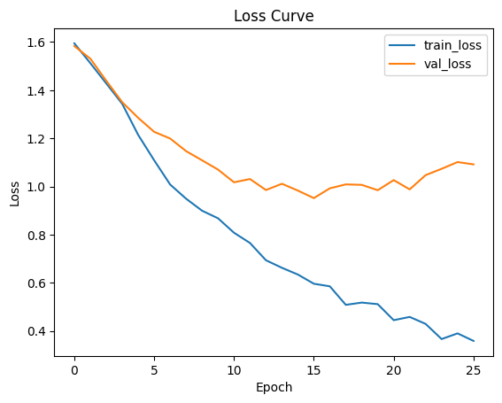
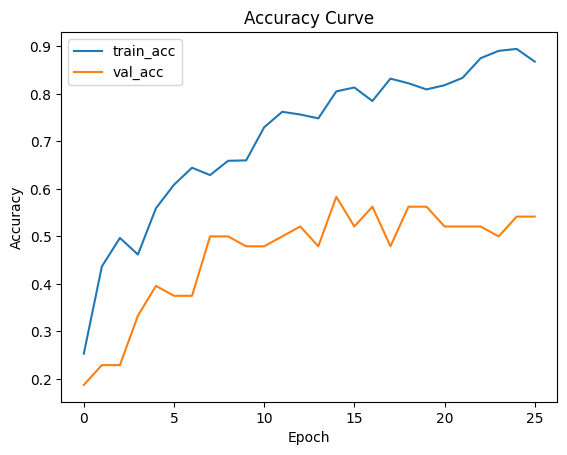
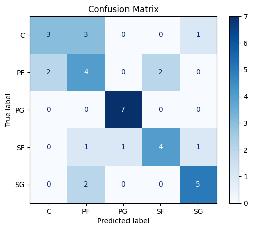

# NBA Player Position Classifier (PyTorch)

A feed-forward neural network built in PyTorch that predicts an NBA player's position (C, PF, PG, SF, SG) from season statistics, advanced metrics, and salary data.

## Overview

| | |
|---|---|
| **Dataset** | [`noahgift/nba`](https://huggingface.co/datasets/noahgift/nba): 239 players from the 2016–17 season, 42 columns (box score, RPM/PIE advanced stats, salary, social media) |
| **Task** | 5-class classification (`POSITION`) |
| **Model** | MLP: 80 → 128 → 64 → 5 with ReLU and dropout (0.25 / 0.20) |
| **Tools** | PyTorch, scikit-learn, pandas, matplotlib |

## Approach

1. **Split**: stratified 70 / 15 / 15 train / validation / test split (167 / 36 / 36 players).
2. **Preprocessing**: a scikit-learn `ColumnTransformer` with median imputation + standardization for numeric stats, one-hot encoding for team → 80 input features.
3. **Training**: Adam (lr = 1e-3), cross-entropy loss, batch size 16, up to 100 epochs with **early stopping** (patience 10) on validation loss; the best checkpoint is restored.
4. **Evaluation**: per-class precision/recall/F1 and a confusion matrix on the untouched test set.

## Results (test set, n = 36)

| Metric | Score |
|---|---|
| Accuracy | **0.639** (vs. 0.20 random baseline) |
| Macro F1 | 0.642 |
| Best class | PG (F1 0.93) |
| Hardest class | PF (F1 0.44) |

<p align="center">
  
  
  
</p>

Point guards are easy to identify (assists, 3-point volume), while the confusion is concentrated between neighbouring "frontcourt" roles (PF ↔ C, SF ↔ PF) whose statistical profiles overlap, a realistic reflection of how fluid modern positions are. With only 167 training players, validation loss plateaus early, which is why early stopping matters here.

## Run it

```bash
pip install -r requirements.txt
jupyter notebook nba_position_classifier.ipynb
```
